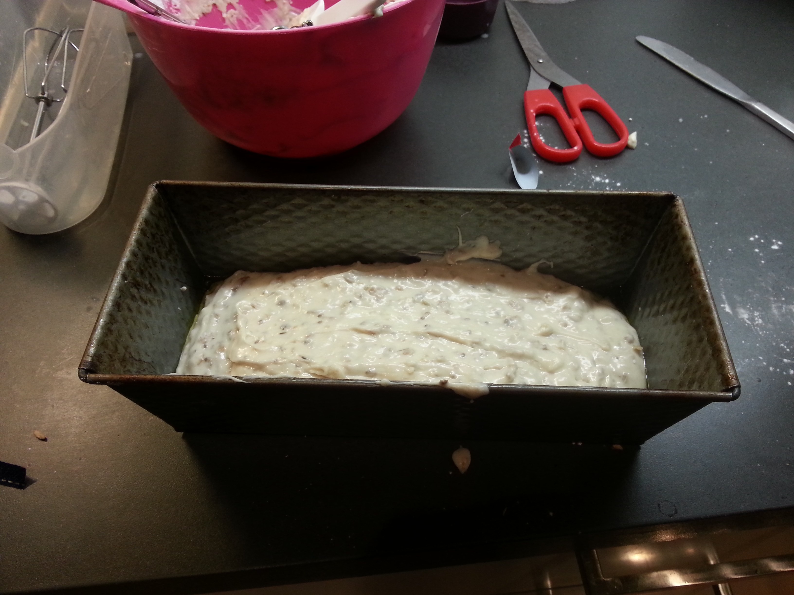

# Glutenfree Form-Bread

For lack of a better description, bread. Glutenfree.

## Ingredients

- 4 dl Milk
- Anise
- 25g fresh yeast
- Fibrex
- Fänkål
- Glutenfree Flour Mix
- Olive Oil

### Optional

- Raisins (will make it sweeter)
- Havregryn

## Instructions

1. Crumble yeast and fibrex in a bowl.

2. Heat up milk to lukewarm temperature, mix with yeast/fibrex. Let it wait for 10 mins.

3. Oil the bread form that you intend to use.

4. Add olive oil and spices. Mix. Proceed to mix in flour until you have a somewhat thick. It should still be fairly runny so that you can still pour it into the form. Depending on how dense you want your bread you can alternate
   the dough. See picture below for how my dough usually looks.

5. Pour the dough into the form and put a towel over it. Let it rise for 30 mins. While it's rising you may want to set the oven to 225C.

6. Put the form into the oven at 225C for 30 mins.

7. Take the form out of the oven. Gently remove the bread from the form and wrap it in a towel. If the bread won't come out of the form, put the form upside down and put a wet towel on it for a few minutes.
