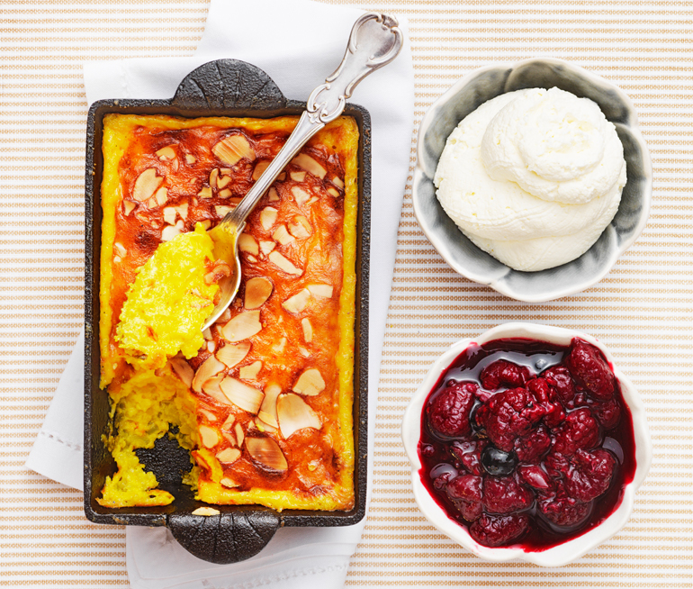

# Saffranspannkaka

A dessert dish we usually serve in my family on holidays.

## Zutaten

1 dl süße Mandeln
1g Safran
3 EL Zucker
½ TL Vanillezucker
1½ dl Schlagsahne
1 L Milchreis (gekocht)
3 Eier
Butter oder margarine (um die Form einzufetten)

## Zum servieren

Salmbärmarmelade (Heidelbeeremarmelade geht auch)
Schlagsahne

## Anweisung

Arbeitszeit: ca 60 min

1. Den Ofen auf 175 C vorheizen.
2. Die Mandeln schälen und hacken.
3. Den Safran mit dem Vanillezucker zusammen rühren.
4. Die Gewürze in dem Schlagsahne einrühren. Die Eier schaumig aufschlagen und unter die Sahne unterheben. Die Mandeln hinzugeben, ein Paar zurückbehalten zum garnieren.
5. Im Ofen ca 45-60 Minuten backen abhängig wie groß die Form ist
